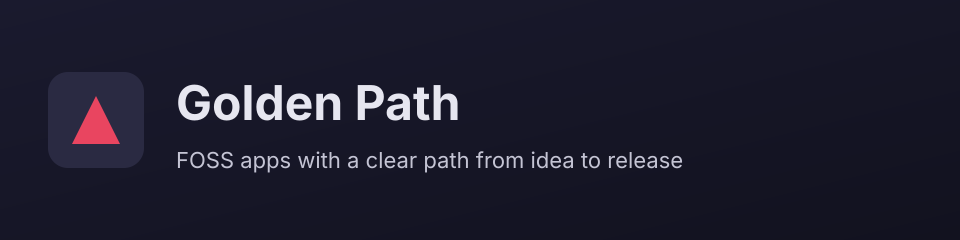

<!-- GENERATED by scripts/generate-project-readme.py — edit branding/product.json -->

  

<h1 align="center">Golden Path</h1>

<strong>FOSS apps with a clear path from idea to release</strong>

  
  
  

  
  
  

## Pitch

Golden Path is the reference product identity shipped with agent-project-bootstrap: a privacy-respecting FOSS stack with design tokens, CI guardrails, and agent-ready sprints so you can go from template to a shippable app without reinventing the foundation.

## Demo

  

> Add screenshots or a short demo GIF under `docs/images/` and link them here when available.

## Features

- Cross-stack design tokens with light, dark, and system themes
- Labeled BUILD_PLAN sprints for humans, agents, and CI
- Web PWA and Android FOSS golden-path stubs ready to prune or extend
- Security defaults: Dependabot, CodeQL, gitleaks, and weekly triage docs
- Replaceable branding kit — swap logos and colors when your identity is ready

## Quick start

1. Clone the repo and run `./scripts/init-project.sh` (or `.\scripts\init-project.ps1` on Windows).
2. Open Cursor and follow `docs/START_HERE.md` → Section 8 Startup Sequence.
3. Set `branding/product.json` `mode` to `product`, fill name/tagline/pitch, then run `python3 scripts/generate-project-readme.py`.

## Install

Requirements depend on your active stack (Node 20+, Python 3.11+, Android SDK). See the active `modules/{stack}/MODULE.md` and `examples/{stack}/README.md`.

## Usage

Use `/bootstrap` for Sprint 0, `/build` for features, and `/verify` before merge. Edit colors in `design-tokens/design-tokens.json` and logos in `branding/assets/`, then run `python3 scripts/sync-design-tokens.py`.

## Configuration

Copy [`.env.example`](../../.env.example) to `.env` for local secrets (never commit `.env`). Stack-specific config lives in the active `examples/` or app root after prune.

## Contributing

See [`../../CONTRIBUTING.md`](../../CONTRIBUTING.md). Prefer small PRs; follow Conventional Commits and the BUILD_PLAN labels (`AGENT` / `HUMAN` / `ADB` / `AUTO`). Status markers: 🔲 open · ✅ done · ❌ blocked.

## Security

See [`../../SECURITY.md`](../../SECURITY.md). Enable Dependabot alerts and follow [`docs/SECURITY_TRIAGE.md`](../../docs/SECURITY_TRIAGE.md) for weekly CVE triage.

## License

[MIT License](../../LICENSE) — see the license file for terms.

## Acknowledgments

Scaffolded with [agent-project-bootstrap](https://github.com/edwardlthompson/agent-project-bootstrap). Brand assets: [`../BRANDING.md`](../BRANDING.md). Design system: [`../../docs/DESIGN_GUIDE.md`](../../docs/DESIGN_GUIDE.md).
