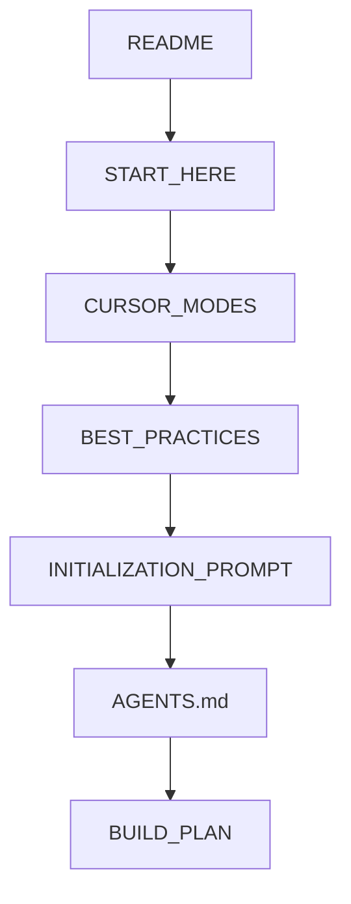

# Start Here

> **Read this file first** — whether you are a human or any coding agent.

## What is this?

`agent-project-bootstrap` is a **GitHub Template Repository** for bootstrapping FOSS projects with coding agents (Cursor, Windsurf, Antigravity, Claude Code, Copilot, and others). Shared contract: [`AGENTS.md`](../AGENTS.md). Tool map: [`AGENT_PORTABILITY.md`](AGENT_PORTABILITY.md). Word list: [`help/GLOSSARY.md`](help/GLOSSARY.md).

## Which repo mode are you in?

- **Bootstrap:** New project from **Use this template** → read `docs/CURSOR_MODES.md`, then `docs/INITIALIZATION_PROMPT.md`
- **Reference:** Existing project using this repo as rules reference → read `docs/CURSOR_MODES.md`, then `docs/FOR_AGENTS.md`

## Cursor modes (Plan / Agent / Debug / Ask)

See [`docs/CURSOR_MODES.md`](CURSOR_MODES.md) — pick the Cursor mode before editing code.

## Agent shortcuts (Bootstrap)

In Cursor, type **`/`** in Agent chat. Start with **[docs/help/BATCH_COMMANDS.md](help/BATCH_COMMANDS.md)** — try `/tour` (10 minutes) or `/bootstrap` on a new project, `/verify` before merge.

In Windsurf, Antigravity, or any other agent: ask it to read [`docs/help/TOUR.md`](help/TOUR.md) (first run) or [`docs/help/COACH.md`](help/COACH.md) (what next).

## Bootstrap Read Order

1. `README.md`
2. `docs/START_HERE.md`
3. `docs/CURSOR_MODES.md`
4. `docs/BEST_PRACTICES.md` (why each convention exists) + `docs/FIRST_30_DAYS.md`
5. `docs/INITIALIZATION_PROMPT.md`
6. `AGENTS.md` (thin adapters via `--sync-adapters`; see `docs/AGENT_PORTABILITY.md`)
7. `docs/spec.md` + `docs/plan.md` (product spec and milestone stub)
8. `BUILD_PLAN.md` Sequential lane
9. Active `modules/{stack}/MODULE.md` only
10. Active `examples/{stack}/` only
11. `docs/WEB_PROJECT_LAYOUT.md` when stack includes web (folder roles, GitHub Pages)
12. `docs/DESIGN_GUIDE.md` when stack includes web or Android UI (tokens, themes, i18n)
13. `branding/BRANDING.md` for logos, official colors, and pitch README generation
14. `docs/FEATURE_MODULES.md` when implementing Sprint 2+ incremental features (vertical slices)

## Reference Read Order

1. `docs/START_HERE.md`
2. `docs/CURSOR_MODES.md`
3. `docs/FOR_AGENTS.md`
4. `TEMPLATE_INDEX.json`
5. `AGENTS.md`
6. Matching `modules/{stack}/MODULE.md` only

## CRITICAL NOTES (phase transitions)

- After **Sprint 0** sign-off: stop treating `docs/INITIALIZATION_PROMPT.md` as the daily read. Follow BUILD_PLAN Sequential, then `/feature` for Sprint 2+ (`docs/features/{name}.md` from `_template.md`, locked API, then Parallel slices).
- Working notes go in gitignored `scratchpad.md` (copy `scratchpad.md.example`). **Reset** on sprint/phase change. Persistent memory stays in `AGENT_MEMORY.md`.
- Child playbook: [`BUILD_PLAN.md`](../BUILD_PLAN.md) — same phase notes under Child Repo Playbook.

## Do Not Read Yet

- Inactive `examples/` folders
- `KNOWLEDGE_BASE.md` — reference when debugging (KB-001–KB-014)
- `docs/MAINTAINING_THE_TEMPLATE.md` (maintainers only)

## BUILD_PLAN Labels

`AGENT` | `HUMAN` | `ADB` | `AUTO` — filter with `grep '\[AGENT\]' BUILD_PLAN.md`. Definitions: [`help/GLOSSARY.md`](help/GLOSSARY.md).

**Status markers:** 🔲 open · ✅ done · ❌ blocked — emoji only (not `- [ ]` checkboxes). Applies to all repo checklists; see legend in `BUILD_PLAN.md`.

## Security

Enable Dependabot alerts on GitHub (Settings → Code security and analysis). Weekly CVE triage: `docs/SECURITY_TRIAGE.md`. Vulnerability reporting: `SECURITY.md`.

## Agent Prompts

**Bootstrap:** Read @docs/START_HERE.md, @docs/CURSOR_MODES.md, and @docs/INITIALIZATION_PROMPT.md. Pick Cursor mode per CURSOR_MODES. Follow Section 8. Use BUILD_PLAN Sequential lane.

**Reference:** Read @docs/CURSOR_MODES.md, @docs/FOR_AGENTS.md, and @TEMPLATE_INDEX.json. Pick Cursor mode per CURSOR_MODES. Apply matching rules. Do not copy examples/ wholesale.
