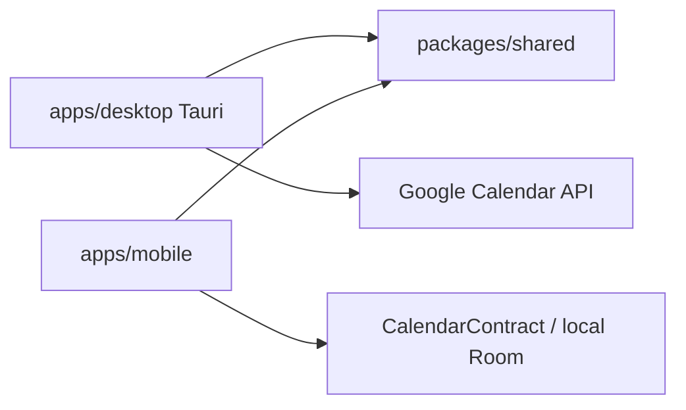

# Product Specification

> Spec-driven development stub for Continuum Calendar. Feature slices still use `docs/features/{name}.md`.
> Status markers: 🔲 open · ✅ done · ❌ blocked.

## Overview

**Product:** Continuum Calendar  
**Purpose:** FOSS calendar with rolling week views (Today as column 1), explicit empty days, optional Google Calendar/Contacts sync, and Android homescreen widgets.  
**Users:** People who want Google when it is useful, local privacy when it is not, and the same agenda on phone and desktop.

## Functional Requirements & User Stories

| ID | Story | Acceptance |
|----|-------|------------|
| FR-1 | As a user I see a rolling week starting at today | Desktop and Android week/agenda surfaces put Today in column 1 |
| FR-2 | As a user I can sign in with my Google account | Desktop Calendar-only OAuth; account must be an OAuth test user while consent is Testing |
| FR-3 | As a user I keep local events when Google is off | Room / desktop store persist local calendars; peer sync does not require a Continuum account |

## Non-Functional Constraints

- MIT FOSS; no proprietary SDKs on the production path
- Never commit `.env`, keystores, or OAuth client secrets
- File budgets: 300 lines static data, 150 lines pure logic
- Desktop product version and Android `versionName` may trail the GitHub template tag

## Architecture & Data Flow

